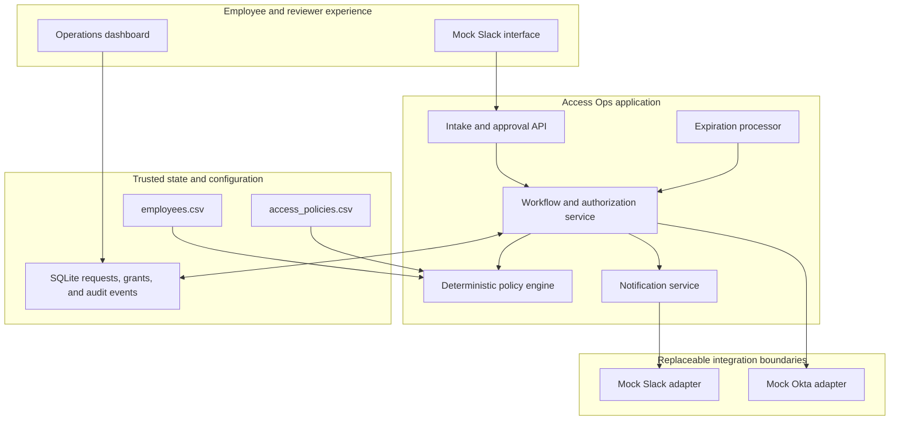
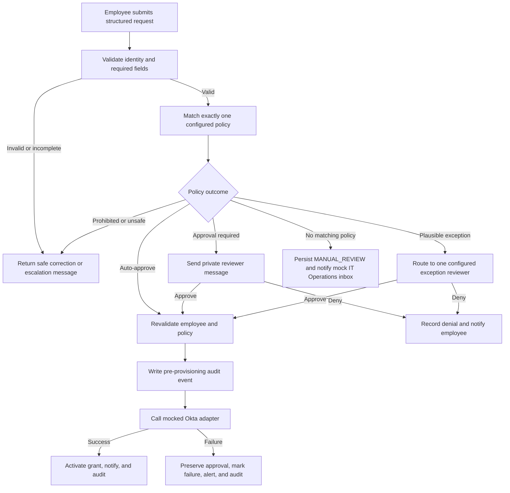
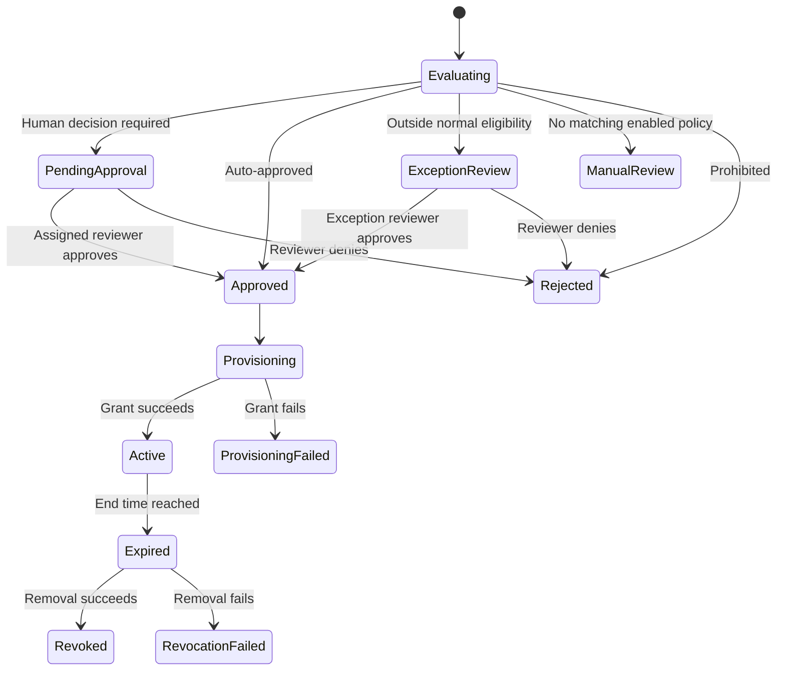
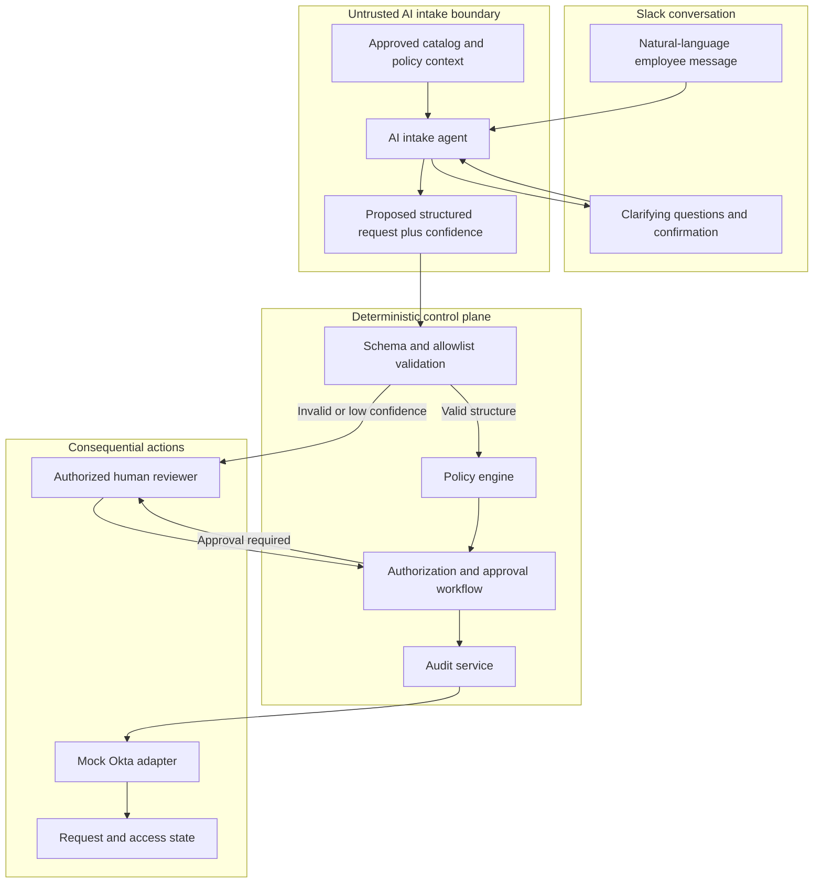
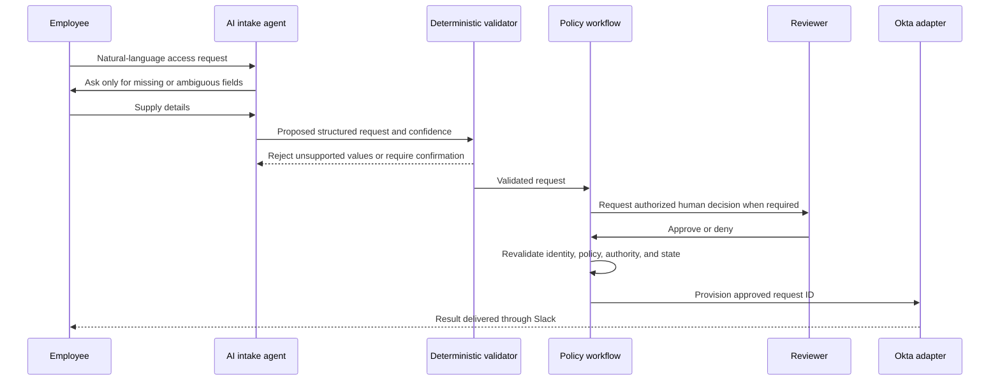

# Access Ops Architecture and Approach Comparison

**Owner:** Branden Lemire  
**Project:** Customer.io Technical Generalist take-home  
**Selected category:** Software access requests  
**Implementation decision:** Build deterministic automation; document agentic intake as an alternative  
**Prototype applications:** GitHub, Figma, Notion, Salesforce, and Snowflake

## 1. Executive Summary

Access Ops is a Slack-based workflow for requesting, approving, provisioning, tracking, and expiring software access. The prototype focuses on one narrow vertical slice: an authenticated employee requests access to a supported application, the request is evaluated against configurable policy, any required reviewer approves or denies it, and a mocked Okta adapter changes access in the prototype directory. Every consequential action is validated and audited.

Two architectures were considered:

1. **Traditional deterministic automation:** Slack collects structured fields and a policy engine makes repeatable routing and authorization decisions.
2. **Agentic automation:** An AI intake agent interprets a natural-language Slack conversation and creates a proposed structured request, but deterministic controls retain authority over eligibility, approval, provisioning, and revocation.

The deterministic architecture will be implemented because software access has predictable inputs and consequential outputs. The current problem is primarily manual intake, routing, and provisioning, not language interpretation. This approach delivers most of the operational value with less risk, lower maintenance, clearer auditability, and a scope appropriate for the assignment.

## 2. Scope and Architectural Principles

### Implemented in the prototype

- Structured Slack-style access intake
- Trusted employee lookup using synthetic directory data
- Configurable application and access policies
- Auto-approval, human approval, exception review, and rejection
- At most one human approver per request
- Mocked Okta provisioning and revocation with real prototype state changes
- Temporary-access expiration
- Request status, employee/reviewer notifications, and audit history
- Safe failure handling, controlled retries, and idempotency
- Operations view and validated CSV configuration

### Mocked boundaries

- Slack identity, modals, messages, and approval buttons
- HRIS/employee directory
- Okta grants and removals
- Slack alerts and confirmations
- Scheduled invocation of expiration processing

### Explicitly excluded

- Production OAuth, SSO, Slack signature verification, hosting, and secrets management
- Hardware/equipment requests and general IT FAQs
- Service accounts, offboarding, licensing, and unrelated removals
- Multiple sequential approvers
- AI authorization, approval, provisioning, revocation, or autonomous error remediation
- Applications outside the five-item catalog
- A general-purpose workflow builder

### Governing principles

- Treat identity and employee attributes as trusted only when retrieved from an authoritative directory.
- Treat every AI output as untrusted data.
- Never provision without a matching policy, required approval, and durable audit event.
- Revalidate employee status, reviewer authority, and policy immediately before provisioning.
- Keep approval separate from provisioning: approval authorizes an attempt; only a successful provider response makes access active.
- Prefer temporary access for exceptions and elevated permissions.
- Fail closed when identity, policy, approval, configuration, or audit persistence is uncertain.

## 3. Traditional Deterministic Architecture: Selected Build

### Component architecture

### Request flow

### Responsibilities by component

| Component | Responsibility | Does not do |
| --- | --- | --- |
| Slack-style interface | Collect structured request fields and display status | Establish employee eligibility |
| Employee directory | Supply identity, department, title, manager, and active status | Accept employee-edited identity claims |
| Policy engine | Match configuration and return a deterministic decision | Provision access or silently guess a rule |
| Workflow service | Enforce state transitions, reviewer authority, revalidation, and idempotency | Treat an approval click as provisioning success |
| Approval service | Assign one authorized reviewer and record approve/deny actions | Permit self-approval or replayed decisions |
| Okta adapter | Grant or remove access in the prototype directory | Decide whether the action is authorized |
| Expiration processor | Find expired grants and request deterministic revocation | Extend access automatically |
| Audit layer | Persist actors, timestamps, policy versions, transitions, and outcomes | Store credentials or unsafe raw provider errors |
| Notification service | Produce safe employee, reviewer, and IT messages | Expose stack traces, tokens, or sensitive payloads |

### Authorization sequence

Before any grant, the workflow must confirm:

1. The requester maps to one active directory employee.
2. Required request fields contain supported values.
3. Exactly one enabled policy matches, or the request enters manual IT review.
4. Any required decision came from the currently assigned reviewer.
5. The requester did not approve their own request.
6. The request remains pending, unexpired, and not previously processed.
7. Employee eligibility and the current policy still permit the action.
8. A pre-provisioning audit event was successfully persisted.

Only then may the adapter receive an approved request ID. It never accepts arbitrary access instructions directly from the interface.

### Temporary-access lifecycle

Standard temporary access may last up to 30 days. Elevated/admin access is limited to 7 days and requires the configured IT/Security reviewer. The demo can invoke the expiration processor directly or advance a mock clock. Failed revocation is treated as a high-priority operational and security event.

## 4. Agentic Architecture: Documented Alternative

### Component architecture

### Agent interaction flow

### Permitted AI responsibilities

- Interpret employee intent from natural language.
- Extract application, access level, business reason, and duration.
- Ask contextual follow-up questions for missing information.
- Present valid choices when multiple interpretations are plausible.
- Explain expected approval steps in plain language.
- Summarize already-handled errors for a human after sensitive data is removed.
- Escalate low-confidence, conflicting, or unsupported requests.

### Prohibited AI responsibilities

- Authorize access or override policy.
- Approve an exception or select an unauthorized reviewer.
- Invent applications, roles, employees, dates, or successful outcomes.
- Provision, revoke, or retry consequential operations directly.
- Modify policy or trusted directory attributes.
- Mark a failed action successful.

### Additional controls required for an agentic version

- Strict structured output schema and application/access allowlists
- Confidence thresholds and employee confirmation before submission
- Prompt-injection resistance and separation of employee text from trusted instructions
- Logging of model, prompt version, retrieved context, structured output, and validation result
- Evaluation datasets for ambiguous, incomplete, adversarial, and unsupported requests
- Redaction and data-retention controls for prompts and model responses
- Deterministic fallback when the model is unavailable
- Ongoing monitoring for extraction accuracy, hallucination, latency, and cost

The agent improves intake only. Removing the agent must not change the authorization or provisioning rules.

## 5. Traditional vs. Agentic Comparison

| Criterion | Traditional deterministic automation | Agentic automation |
| --- | --- | --- |
| Authorization risk | Lower: explicit policy and state checks | Higher if AI output crosses the intake boundary; contained only by deterministic validation |
| Predictability | Same valid inputs produce the same decision | Natural-language interpretation may vary across runs or model versions |
| Employee experience | Fast and clear, but requires a structured form | More conversational and tolerant of how employees naturally ask for help |
| Handling missing data | Returns specific field-level validation | Can ask adaptive follow-up questions |
| Handling ambiguity | Requires choices or manual escalation | Can interpret intent, clarify, and summarize uncertainty |
| Auditability | Policy version and state transitions are straightforward to trace | Requires all deterministic records plus prompt, model, retrieval, confidence, and output logs |
| Testing | Decision tables and repeatable workflow tests | Requires deterministic tests plus probabilistic evaluation suites |
| Maintenance | Update validated policy/configuration records | Maintain policies, prompts, retrieval content, evaluations, and model behavior |
| Implementation time | Fits a focused take-home and narrow production pilot | Adds integration, guardrail, evaluation, and observability work |
| Failure surface | Known validation, configuration, provider, and state failures | Adds hallucination, extraction, prompt injection, drift, latency, and model outage |
| Operating cost | Minimal at current request volume | Adds token usage, model monitoring, and evaluation costs |
| Best fit | Stable request catalog with consequential outcomes | High language variability where incomplete intake is the main cost |
| Extensibility | New supported paths require explicit configuration | New conversational intents are easier to recognize, but actions still need explicit policy |

## 6. Pros and Cons

### Traditional deterministic automation

**Pros**

- Strongest predictability for consequential access decisions
- Straightforward authorization boundaries and least-privilege enforcement
- Clear audit trail showing the exact policy and state transition used
- Easier unit, integration, replay, duplicate, and failure-path testing
- Low operating cost and no model dependency
- Simple failure modes with deterministic remediation
- Fits the 40–50 weekly-message scenario and assignment time box
- Easier for a nontechnical owner to maintain through validated CSV configuration
- Provides a stable control plane that can support future Slack, Okta, or AI adapters

**Cons**

- Employees must use a structured form or predefined commands
- Less tolerant of informal, incomplete, or ambiguous requests
- New applications and access levels require deliberate configuration
- Complex exception policies can create branching rules over time
- Does not address broader conversational FAQs or equipment questions
- Poorly governed configuration could still introduce unsafe rules

### Agentic automation

**Pros**

- Employees can request help in natural language
- Contextual follow-ups can reduce incomplete submissions
- Better suited to varied questions spanning access, equipment, and FAQs
- Can translate policy and status into clearer employee-facing explanations
- Can recognize plausible exceptions that rigid forms may not anticipate
- A read-only AI layer could summarize incidents and reduce diagnostic effort

**Cons**

- Adds probabilistic behavior to a workflow involving consequential access
- Requires deterministic validation anyway, so it does not replace the core policy workflow
- Creates new hallucination, prompt-injection, availability, latency, and drift risks
- Requires model/prompt/version logging and a larger evaluation program
- Adds privacy and retention considerations for employee messages
- Costs more to build, operate, monitor, and hand off
- Difficult to justify when the application catalog and valid request fields are already bounded
- Can create false confidence if conversational fluency is mistaken for authorization accuracy

## 7. Decision and Rationale

Access Ops will implement traditional deterministic automation.

The decision is based on three points:

1. **Risk:** Access provisioning is consequential. Eligibility, approver authority, state transitions, and expiration must remain predictable and auditable.
2. **Problem fit:** The inputs are bounded: five applications, configured access levels, trusted employee attributes, durations, and explicit approval paths. The primary cost is manual routing and provisioning rather than language ambiguity.
3. **Delivery value:** A deterministic build demonstrates the complete workflow, including authorization, approval, real prototype state change, failures, idempotency, and revocation, within the assignment's focused scope.

This is not a blanket rejection of AI. It places AI where its strengths are useful and contains it where errors are consequential. A future AI intake layer can sit in front of the same deterministic control plane without redesigning authorization or provisioning.

## 8. Conditions That Would Change the Decision

An AI intake layer becomes more compelling when:

- Incomplete or ambiguous messages, rather than provisioning, become the dominant source of IT effort.
- The workflow expands across access requests, equipment needs, and broad FAQs.
- Employees strongly resist structured forms and measurable completion rates suffer.
- An approved knowledge base and evaluation dataset are available.
- The organization accepts the additional privacy, monitoring, cost, and maintenance burden.

Even under those conditions, the following remain deterministic: supported applications and roles, employee eligibility, approver authority, self-approval prevention, policy evaluation, state transitions, provisioning, revocation, retries, and audit requirements.

Recommended architecture by request category:

| Request category | Recommended approach | Reason |
| --- | --- | --- |
| Software access | Deterministic or hybrid | Consequential authorization requires explicit controls |
| General IT FAQs | AI-first with retrieval and citations | Language is variable and outputs are generally informational |
| Hardware/equipment | Hybrid | AI can gather needs; rules control eligibility, inventory, budget, and purchasing |

## 9. Failure and Recovery Design

| Failure | Safe response |
| --- | --- |
| Missing required field | Set `Needs Information` and identify the specific missing value |
| Unknown application or access level | Do not guess; route to IT review |
| Directory unavailable | Pause evaluation and authorize nothing |
| No matching policy | Persist `MANUAL_REVIEW`, notify the mock IT Operations inbox for investigation, and authorize nothing |
| No approver configured | Stop safely and route the issue to IT; this is separate from the no-policy path |
| Unauthorized or self-approval attempt | Reject the action and audit it |
| Duplicate submission | A separate request record may be created; duplicate provider grants are prevented |
| Duplicate approval | Reject and audit the replay without provisioning again |
| Transient provider failure | Retry immediately, up to three provider attempts total, using the stable operation key; no delay, backoff, or scheduled retry is implemented |
| Authentication failure | Stop and alert IT; do not retry blindly |
| Provisioning failure | Preserve valid approval, mark provisioning failed, and allow controlled retry |
| Confirmation failure | Preserve successful access state and retry only the notification |
| Revocation failure | Mark revocation failed and alert IT immediately |
| Audit persistence failure | Stop before provisioning |

Employee messages explain what happened, the current status, the next step, and the request ID without exposing stack traces, credentials, or raw provider errors.

## 10. Maintainability and Production Evolution

Routine application, access, eligibility, reviewer, duration, and enabled-status changes are stored as validated CSV records rather than application-specific Python conditionals. A nontechnical IT owner can edit them in Excel or Google Sheets, export CSV, validate the configuration, and review the resulting behavior.

Policy changes remain security-sensitive. Production should replace local CSV and simulated roles with:

- A versioned policy datastore and authenticated administration interface
- Change preview, automated policy tests, approval, audit history, and rollback
- Company SSO and role-based administration
- Real Slack request verification and scoped Okta credentials
- Secrets management, encryption, retention rules, backups, and monitoring
- A production scheduler for expiration and alerts for failed revocation
- Shadow mode followed by a low-risk pilot before broader automation

## 11. Success Measures

Success means safe workload reduction, in this priority order:

1. Zero unauthorized provisioning
2. Correct routing and approval
3. Complete auditability
4. Faster employee response and access
5. Fewer manual IT touches

Prototype acceptance requires every request to receive an immediate response; required approvals to be enforced; self-approval to fail; successful provisioning to create access; denial to create no access; duplicate processing to remain idempotent; temporary grants to be removed; and all decisions, actions, and failures to be audited.

Production metrics should include time to first response, submission-to-access time, approver latency, automation rate, manual touches, routing accuracy, provisioning success, on-time revocation, employee satisfaction, weekly IT hours saved, and unauthorized provisioning events. Final targets should be set only after measuring the current process and running a controlled pilot.

## 12. Concise Defense for the Review

> I chose deterministic automation because the highest-risk part of this workflow is authorization, not language interpretation. The request space is bounded, so structured intake and explicit policy give us predictable decisions, strong auditability, and straightforward testing. I still designed an agentic alternative, but the AI is limited to interpreting and clarifying employee intent. In both designs, deterministic controls retain authority over eligibility, approval, provisioning, and revocation.

## Source Documents

- `Scope_and_Decisions.md`, decision date September 10, 2026
- `Blueprint.md`, architecture approved before implementation
