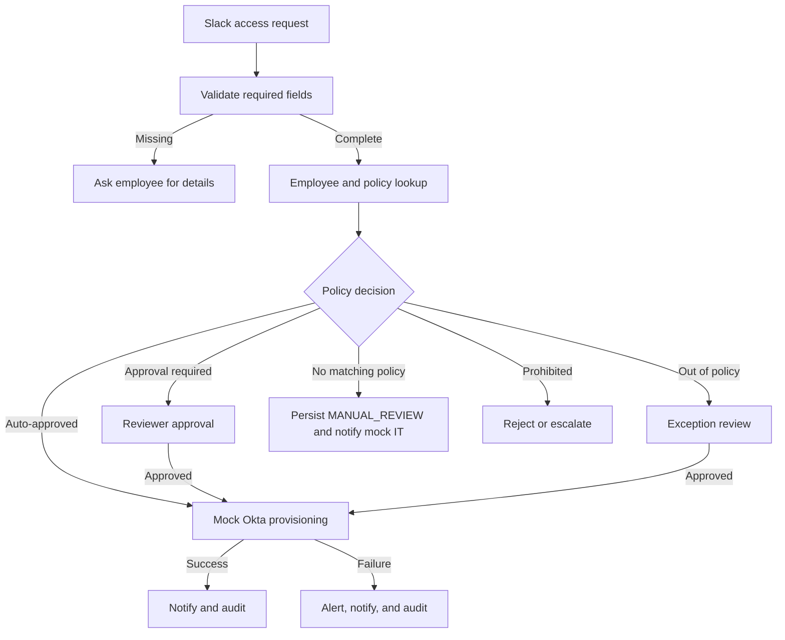
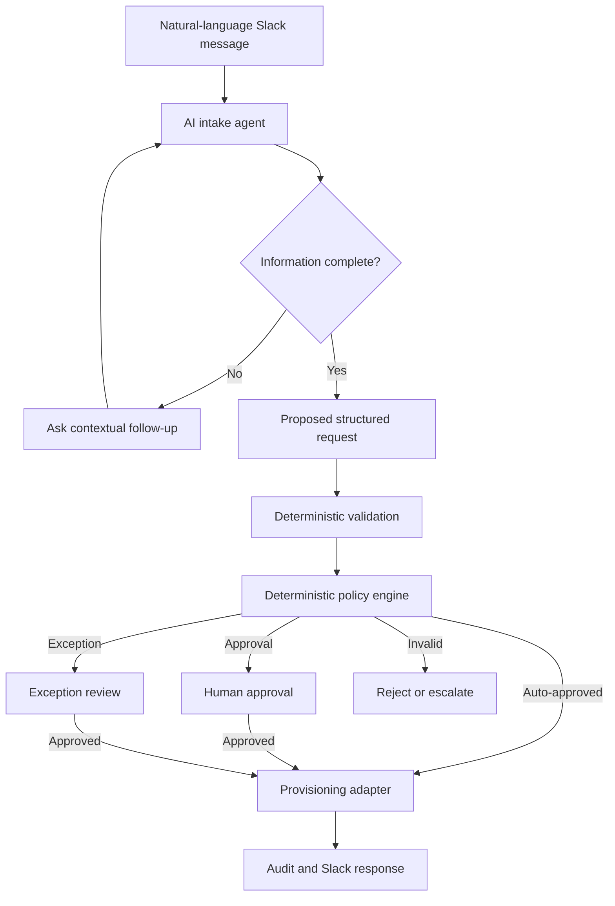
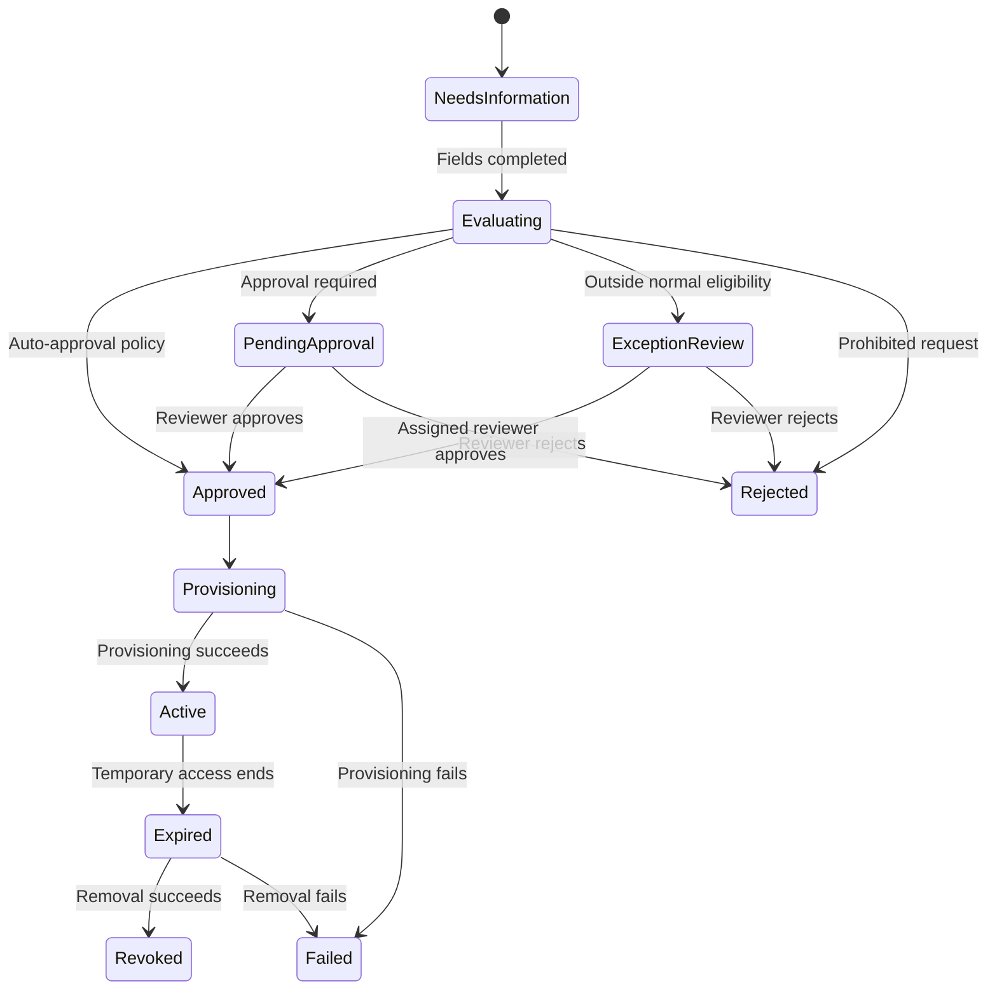

# Customer.io IT Access Automation Blueprint

**Day 4 human refinement:** Branden authorized reasoned normal/exception rejection, explicit reasoned manual access removal, and structured editing of existing policy rows. The current implementation boundaries are specified in the Day 4 amendment to `Implementation_Contract.md` and `Technical_Design.md`. Process-step explanations remain in documentation and are removed from application pages; the UI focuses on actions, results and ownership. This does not introduce runtime AI, production authentication or real Slack/Okta integrations.

**Owner:** Branden Lemire  
**Status:** Implemented local prototype; architecture remains the reference design
**Selected category:** Software access requests  
**Implementation choice:** Deterministic automation  

## 1. Problem Statement

The IT team receives 40–50 Slack messages each week across software access, hardware/equipment, and general IT FAQs. Software access requests currently require manual triage and provisioning through Okta, with no structured intake, consistent tracking, or clear SLA visibility.

This project will implement one narrow vertical slice: a Slack-style software access request that is validated, evaluated against configurable policies, approved when necessary, provisioned through a mocked Okta adapter, communicated back to the employee, and recorded in an audit trail.

The goal is safe workload reduction: faster employee access and fewer manual IT touches without weakening authorization or auditability.

## 2. Stakeholder Questions

Before a production build, ask:

1. Which applications and access levels generate the most requests?
2. Which requests can be auto-approved today, and who owns those policies?
3. Who may approve standard, elevated, administrative, and exception access?
4. Can managers approve access outside their own department or application ownership?
5. Which employee attributes are authoritative: department, title, manager, location, employment type, or something else?
6. Which systems provide employee identity and authorization data?
7. Does Okta expose every required provisioning action through its API or workflows?
8. Which applications require licensing, security training, or additional prerequisites?
9. What are the expected approval and provisioning SLAs?
10. How should contractors, inactive employees, leaves of absence, and terminations be handled?
11. What audit fields and retention periods are required by Security or Legal?
12. Which failures require immediate IT or Security alerts?
13. How often do employees submit incomplete or ambiguous requests?
14. How many current requests are truly repetitive, and how much time does IT spend on them?
15. Who will maintain the application catalog and approval policies after handoff?

## 3. Prototype Assumptions

- Slack provides the authenticated employee identity.
- A mocked employee directory provides department, title, manager, and active status.
- The prototype supports five applications: GitHub, Figma, Notion, Salesforce, and Snowflake.
- Standard access may be auto-approved only when an explicit policy permits it.
- Elevated and administrative access requires human approval.
- Out-of-policy requests may be legitimate and enter an exception-review path instead of being rejected automatically.
- Each prototype request requires at most one human approval; sequential approvals are intentionally out of scope.
- Temporary access is supported and must have an expiration time.
- Okta, Slack messaging, approval interactions, and directory integrations are mocked.
- SQLite is sufficient for the local prototype.
- Authentication, Slack signature verification, secrets management, and production infrastructure are documented but not implemented.
- Initial performance and reliability targets are provisional until a real baseline is measured.

## 4. Scope

### Implemented

- Slack-style structured intake
- Required-field validation
- Employee and application-policy lookup
- Deterministic policy evaluation
- Auto-approval, human approval, exception review, and rejection paths
- Mock provisioning and revocation
- Temporary-access expiration processing
- Employee and reviewer notifications represented locally
- Request status tracking
- Append-only audit events from the application's perspective
- Operations dashboard
- Editable policy configuration
- Demonstrable failure scenarios

### Mocked

- Slack messages, modals, and interactive approval buttons
- Employee directory/HRIS data
- Okta provisioning and removal
- Slack alerts and confirmations
- User identity and role selection

### Excluded

- Real Slack or Okta OAuth/API credentials
- Production authentication and SSO
- Production deployment and containerization
- Hardware/equipment requests
- General IT FAQs
- Multiple sequential approvers
- AI independently authorizing, approving, provisioning, or retrying access changes
- A general-purpose workflow builder

## 5. Traditional Architecture: Implemented Design

### Components

1. **Intake:** Accepts and validates structured access requests.
2. **Policy engine:** Produces auto-approval, normal approval, exception review, rejection, or IT review.
3. **Approval workflow:** Confirms reviewer authority and records decisions.
4. **Provisioning adapter:** Mocks Okta grants and removals behind a replaceable boundary.
5. **Audit and notification layer:** Records state changes and produces Slack-style responses.
6. **Configuration interface:** Allows an authorized nontechnical owner to maintain policies.
7. **Operations dashboard:** Surfaces status, performance, expirations, and failures.

The policy engine, not AI, decides whether access is permitted and which approval is required.

## 6. Agentic Architecture: Documented Alternative

### Permitted AI responsibilities

- Interpret natural-language requests.
- Extract application, access level, reason, and duration.
- Ask contextual follow-up questions.
- Present choices when multiple interpretations are plausible.
- Explain approval requirements.
- Summarize exceptions or technical errors for humans.
- Route low-confidence interpretations to IT.

### Prohibited AI responsibilities

- Authorize access or override policy.
- Approve an exception.
- Select an unauthorized approver.
- Provision or revoke access directly.
- Invent unsupported applications or access levels.
- Mark a failed action successful.
- Autonomously retry consequential operations.

All model output is untrusted until application names, employees, access levels, dates, approvers, and state transitions pass deterministic validation.

## 7. Architecture Comparison and Decision

| Criterion | Traditional automation | Agentic automation |
|---|---|---|
| Authorization risk | Low; explicit rules and approvals | Higher if model output is trusted broadly |
| Predictability | Same input produces the same outcome | Interpretation can vary |
| Natural-language experience | Structured but less flexible | Conversational and flexible |
| Missing information | Specific validation messages | Contextual follow-up questions |
| Ambiguity | Predefined choices or escalation | Can interpret and clarify intent |
| Auditability | Rules and transitions are traceable | Also requires prompt, output, confidence, and model-version logging |
| Maintenance | Policies maintained through configuration | Policies, prompts, evaluations, and model behavior require maintenance |
| Testing | Decision tables and deterministic workflows | Deterministic tests plus probabilistic evaluations |
| Implementation time | Fits the focused assignment | Adds material implementation and testing scope |
| Operating cost | Minimal | Includes model usage and monitoring |
| Fit for current volume | Appropriate | Hard to justify for access alone |
| Failure surface | Known integration and rule failures | Adds extraction, hallucination, and model availability risks |

### Decision

Implement deterministic automation because access requests have predictable inputs and consequential outputs. The primary bottleneck is manual routing and provisioning, not complex language interpretation. This design provides most of the operational value with stronger predictability, auditability, and maintainability.

The components preserve a future AI intake layer without changing the authorization, policy, approval, provisioning, or audit boundaries.

### Conditions that could reverse the decision

Reconsider an AI intake layer if natural-language ambiguity and incomplete requests become the primary operational cost, especially if the workflow expands across access, hardware, and FAQs. Even then, authorization and provisioning remain deterministic.

### Approach by request category

| Category | Recommended approach | Reason |
|---|---|---|
| Software access | Traditional/hybrid | Consequential authorization needs deterministic controls |
| General IT FAQs | AI-first with retrieval | Highly variable language and low-risk informational output |
| Hardware/equipment | Hybrid | AI can gather needs; rules control inventory, eligibility, budget, and purchasing |

FAQ answers must be grounded in an approved knowledge base, link to their source, express uncertainty, and escalate unsupported questions. Hardware recommendations must never independently create purchases.

## 8. Application Policy Catalog

### Implemented prototype policy examples

| Application | Access | Eligible users | Decision | Approver |
|---|---|---|---|---|
| GitHub | Read | Engineering | Auto-approve | None |
| GitHub | Write | Engineering | Approval | Manager |
| GitHub | Admin | Engineering leadership | Approval | IT/Security |
| Figma | View | Any active employee | Auto-approve | None |
| Figma | Editor | Product/Design | Auto-approve | None |
| Notion | Standard | Any active employee | Auto-approve | None |
| Salesforce | Standard | Sales/Customer Success | Approval | Manager |
| Snowflake | Read | Data/Engineering | Approval | Manager |
| Snowflake | Write | Data/Engineering | Approval | Data owner |

The shipped demo catalog starts with these five applications and the policy rows in `config/access_policies.csv`; GitHub Admin is the only elevated example. Policies are stored as editable records rather than application-specific conditional code. The Day 4 local lifecycle extension can add a catalog entry for demonstration or maintenance, but this does not make the prototype a general-purpose IAM platform.

For the prototype's Product Manager → GitHub Write exception, the exception policy assigns one configured GitHub application owner or IT reviewer. It does not require both a manager and an application owner.

## 9. Exception Handling

Eligibility rules define the low-risk path; they are not an inflexible statement that everyone else has no legitimate need.

Example: A Product Manager needs temporary GitHub write access for a website launch but does not match the normal Engineering eligibility rule.

1. The system identifies the policy mismatch.
2. The request enters `Exception Review` rather than automatic rejection.
3. The employee receives an explanation.
4. The request is routed directly to the configured GitHub application owner or IT reviewer.
5. That reviewer approves or denies the exception after evaluating the business reason, requested access, and duration.
6. The provisioning adapter grants access only after that single required approval.
7. The exception and reviewer decision are audited.

The prototype intentionally limits every request to at most one approver. A production system could require manager plus application-owner approval for selected high-risk cases, but sequential approval chains are outside this take-home scope.

Temporary access should be preferred for exceptional elevated access unless permanent access is explicitly justified.

## 10. Request Data Model

### Employees

- Slack user ID
- Name and email
- Department and job title
- Manager
- Active/inactive status

### Application policies

- Application and access level
- Eligible departments/titles
- Auto-approval flag
- Approver role
- Temporary-access permission and maximum duration
- Active/inactive status
- Policy version

### Access requests

- Request ID and requester
- Application and access level
- Business reason
- Permanent or temporary access
- Expiration date
- Current status
- Assigned approver
- Created and updated timestamps
- Provisioning result

### Audit events

- Request ID
- Event type
- Actor
- Previous and new status
- Timestamp
- Policy/rule version
- Non-sensitive human-readable details

The current request record shows where the request is now; the audit history explains how it got there.

## 11. Request Lifecycle

## 12. Temporary Access

- Temporary requests require an expiration date.
- Standard access may last up to 30 days.
- Elevated/admin access may last up to 7 days.
- Longer requests enter IT review.
- Expiration is detected only when `process_expired_access()` is explicitly invoked; an automatic production scheduler is future-state.
- Revocation uses the same controlled provisioning adapter.
- Failed removal produces an immediate IT alert and audit event.

## 13. Authorization and Security Controls

- Unknown employees are escalated; inactive employees are rejected.
- Unsupported applications or access levels are never guessed.
- Requesters cannot approve their own requests.
- Only assigned, currently authorized reviewers can approve.
- Approval authority is checked when the action occurs, not only when a button is created.
- Admin access always requires IT/Security approval.
- Provisioning accepts only an approved request ID, not arbitrary access instructions.
- Policy changes require an IT/Security administrator and are audited.
- Production Slack requests would require signature verification.
- Credentials belong in a secrets manager and never in source code or logs.
- Logs should redact secrets, tokens, and sensitive payloads.
- Employees should not submit passwords, API keys, tokens, customer data, or unnecessary personal information.
- Production traffic and stored data require encryption and an agreed retention policy.

The prototype simulates roles and identity. Production would use company SSO and role-based access controls.

## 14. Failure Handling

| Failure | Safe behavior |
|---|---|
| Missing required field | Set `Needs Information` and ask for the specific value |
| Unknown application/access | Reject safely with an `INTAKE_STOPPED` audit outcome; do not persist `MANUAL_REVIEW`, which is reserved for otherwise-valid intake with no enabled policy match |
| Directory unavailable | Pause evaluation; do not authorize |
| No matching policy | Persist `MANUAL_REVIEW`, notify mock IT for investigation, and authorize nothing |
| No approver configured | Stop safely, retain the request, and route the issue to IT; no access is authorized |
| Approval notification fails | Keep `Pending Approval`; retain the request |
| Unauthorized approval attempt | Reject and audit the action |
| Duplicate approval/rejection action | Reject and audit the invalid/replayed review action; do not return the prior result as a successful duplicate |
| Provisioning failure | Set `PROVISIONING_FAILED`; retain valid approval and return local IT guidance; no automatic terminal-failure recovery workflow exists |
| Provider success followed by completion persistence failure | Do not claim completion; the request can remain `PROVISIONING` and requires manual reconciliation. There is no generic notification retry mechanism |
| Revocation failure | Set `Revocation Failed` and alert IT immediately |
| Database write failure | Stop; do not approve or provision without an audit record |

Only transient provider failures receive bounded immediate retries: at most three provider attempts total, with no sleep, delay, backoff, or scheduled retry. Stable request-specific operation keys such as `REQ-1042:grant` and `REQ-1042:revoke` prevent duplicate provider operations. Separate submissions may create separate request records, but the provider prevents duplicate access grants.

The demo will provide explicit failure controls so failure behavior can be shown reliably rather than depending on random breakage.

## 15. Success Metrics

Success is safe workload reduction, not maximum automation.

Priority order:

1. Zero unauthorized access
2. Correct routing and approval
3. Reliable auditability
4. Faster employee response
5. Reduced manual work

| Metric | Initial target or use |
|---|---|
| Time to first response | Establish baseline, then set a pilot target |
| Auto-approved provisioning time | Establish baseline, then set a pilot target |
| Human approval latency | Establish baseline, then reduce |
| Automation rate | Measure the pilot; set target after baseline |
| Manual touches | Measure the pilot; set target after baseline |
| Correct policy-routing rate | 100% in deterministic tests; establish production baseline |
| Provisioning success rate | Measure provider-backed pilot; set target after baseline |
| On-time temporary revocation | Establish operational baseline |
| Unauthorized provisioning | Zero |
| Employee satisfaction | Slack thumbs-up/down or short survey |
| Weekly IT time saved | Compare with current manual baseline |

These are measurement plans or illustrative pilot targets, not established performance facts. The 24-hour Operations display is a separate illustrative prototype assumption, not a Customer.io SLA.

## 16. Monitoring and Alerts

The implemented Operations view shows:

- Requests by status
- Auto-approved versus human-approved requests
- Requests awaiting approval
- Persisted created/updated timestamps and derived age against the illustrative 24-hour demo target
- Provisioning and revocation failures
- Temporary access and follow-up states
- Exceptions and operational follow-up
- Recent audit events

The prototype persists mock IT follow-up deliveries for supported manual-review and revocation-failure paths. Automated alerts, reminders, and escalation timers are future-state. In production, alert IT when:

- Provisioning fails after the retry limit.
- Temporary access cannot be revoked.
- A request has no valid approver.
- A stakeholder-defined approval SLA is exceeded (future-state; the prototype has no approval timer).
- Someone attempts an unauthorized approval.
- The policy engine cannot find a valid rule.
- Failure rates exceed an agreed threshold.

## 17. Rollout Strategy

1. **Shadow mode:** Evaluate requests and compare recommendations with IT decisions; do not provision automatically.
2. **Pilot:** Enable one low-risk path, such as Engineering to GitHub read.
3. **Expansion:** Add policies only after routing accuracy, failures, and audit history meet agreed thresholds.

## 18. Maintainability and Handoff

A nontechnical IT owner should be able to use the configuration interface to:

- Activate or deactivate applications and policies.
- Change eligible departments or titles.
- Change approval requirements and approver roles.
- Change temporary-access limits.
- Inspect requests, failures, exceptions, and audit history.

They should not need to edit Python code for routine policy changes. Structural workflow changes, new integrations, authentication changes, or new authorization models still require engineering review.

## 19. AI Usage Log

| Tool/task | Useful result | Limitation or rejected suggestion | Branden's decision |
|---|---|---|---|
| ChatGPT/Codex: scope selection | Helped narrow the build to software access | Broader coverage would dilute the vertical slice | Build one category deeply |
| ChatGPT/Codex: architecture comparison | Clarified deterministic versus agentic boundaries | Agentic features did not justify their risk and maintenance for access | Build deterministic; document agentic |
| ChatGPT/Codex: initial eligibility and exception design | Proposed rigid out-of-policy rejection, then a two-stage manager + application-owner exception approval | The first version was too rigid; the second added more approval complexity than this prototype needs | Branden kept a human exception path but limited it to one configured GitHub owner/IT reviewer |
| ChatGPT/Codex: error-handling AI | Identified potential AI summaries and diagnostics | AI-led corrective actions could cross a consequential boundary | Keep AI advisory only and defer it from the prototype |
| ChatGPT/Codex: infrastructure | Compared Docker and local setup | Docker adds explanation and failure surface without improving the workflow | Use a lightweight local Python setup |

### Genuine AI overrule

The initial AI-designed policy treated employees outside eligible departments/titles too rigidly. After Branden challenged it with a realistic Product Manager who needs GitHub write access, the proposed exception path then required both manager and application-owner/IT approval. Branden overruled that added complexity for the take-home: the exception now routes directly to one configured GitHub application owner or IT reviewer. This preserves human review for out-of-policy access while honoring the prototype rule that each request has at most one approver and avoiding a sequential workflow that is unnecessary for the narrow demonstration.

## 20. Implementation sequence used

The smallest working vertical slice is:

> An active Engineering employee requests GitHub read access. The application validates the request, matches an auto-approval policy, calls the mock Okta adapter, records the audit trail, and returns a Slack-style success message.

Then add, in order:

1. Normal human approval
2. Product Manager/GitHub exception review
3. Rejection and missing-information paths
4. Temporary access and revocation
5. Provisioning/revocation failure demonstrations
6. Policy editor and operations dashboard
7. Automated tests for normal, ambiguous, unauthorized, exception, duplicate, and failure scenarios

## 21. Definition of Architecture Complete

- Scope, assumptions, and exclusions are explicit.
- Both architectures are documented.
- The implementation decision is clear and defensible.
- Policy, approval, exception, and authorization boundaries are defined.
- Data, request states, integrations, and mocks are specified.
- Failures default safely and remain auditable.
- Success metrics and monitoring are defined.
- A nontechnical maintenance approach is documented.
- AI usage and Branden's genuine override are recorded.
- The completed vertical slice remains explainable without making additional foundational policy decisions.
